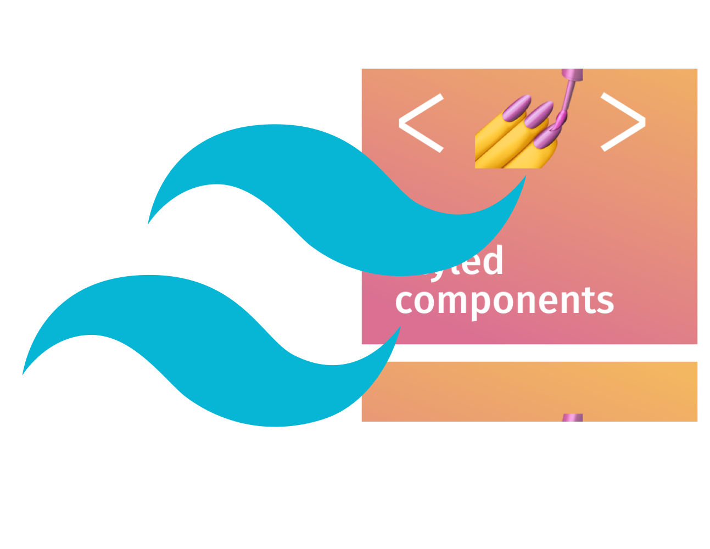
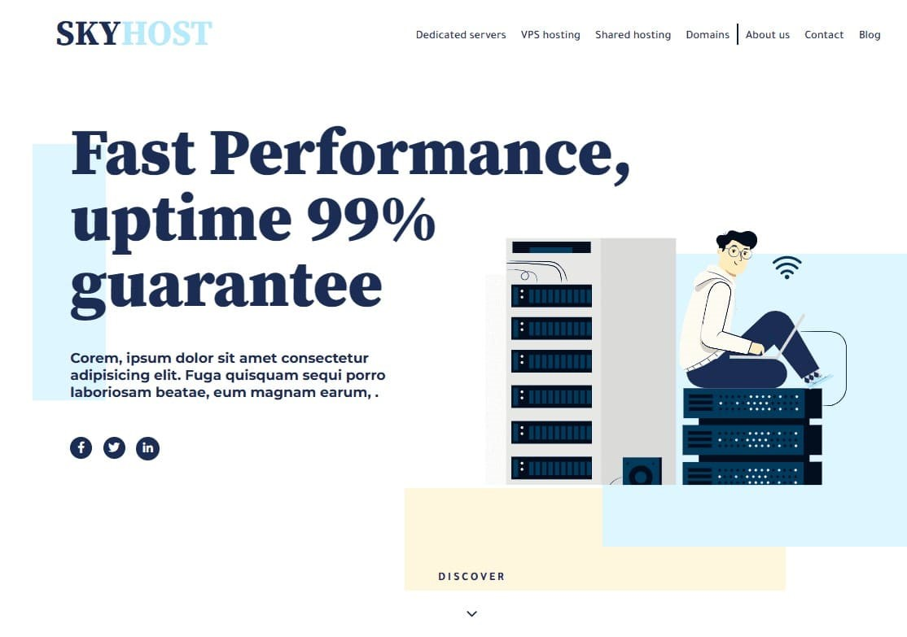
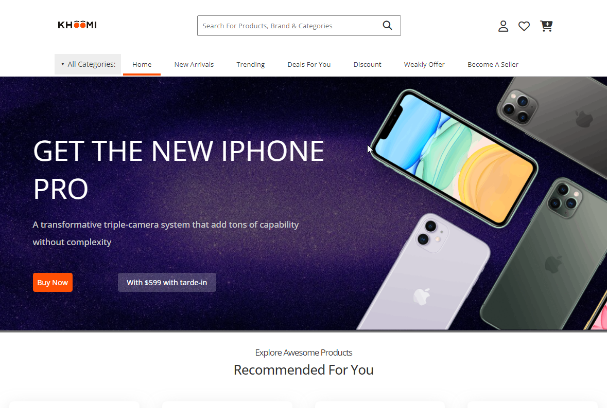

This file is a merged representation of a subset of the codebase, containing files not matching ignore patterns, combined into a single document by Repomix.

# File Summary

## Purpose
This file contains a packed representation of a subset of the repository's contents that is considered the most important context.
It is designed to be easily consumable by AI systems for analysis, code review,
or other automated processes.

## File Format
The content is organized as follows:
1. This summary section
2. Repository information
3. Directory structure
4. Repository files (if enabled)
5. Multiple file entries, each consisting of:
  a. A header with the file path (## File: path/to/file)
  b. The full contents of the file in a code block

## Usage Guidelines
- This file should be treated as read-only. Any changes should be made to the
  original repository files, not this packed version.
- When processing this file, use the file path to distinguish
  between different files in the repository.
- Be aware that this file may contain sensitive information. Handle it with
  the same level of security as you would the original repository.

## Notes
- Some files may have been excluded based on .gitignore rules and Repomix's configuration
- Binary files are not included in this packed representation. Please refer to the Repository Structure section for a complete list of file paths, including binary files
- Files matching these patterns are excluded: cloudflare-env.d.ts, pnpm-yaml.json, .git/, .open-next/, migrations/, Notes/, imgs/, src/components/ui, src/components/smart-form.tsx, src/components/strength-meter.tsx, src/app/globals.css, package.json, repomix.config.json
- Files matching patterns in .gitignore are excluded
- Files matching default ignore patterns are excluded
- Files are sorted by Git change count (files with more changes are at the bottom)

# Directory Structure
```
css/
  media.css
  style.css
index.html
main.js
script.js
```

# Files

## File: script.js
```javascript
function sendEmail (){
    console.log("it works")
    var params={
    from_name: document.getElementById("fullName").value,
    message: document.getElementById("message").value,
    email_id: document.getElementById("email").value
    }
 emailjs.send("service_e9dlam5","template_x6zsbs9",params).then(()=> alert("Send Successfully"))
}
```

## File: main.js
```javascript
let mode = document.querySelector(".mode")
let sudo=document.querySelectorAll(".sudo")
// let dynamicIsland = document.querySelector(".nav-cobtn-contntainer")
let glassF=document.querySelectorAll(".glass-f")
let navContainer = document.querySelector(".nav-container nav")
let btnCont = document.querySelector(".btn-cont .btn")
let lis = document.querySelectorAll("header nav ul li")
mode.addEventListener("click",function(){
    console.log(mode)
    sudo.forEach((el)=>{
        el.classList.toggle("light-on")
    
        glassF.forEach(ele=>{
            if(el.classList.contains("light-on")){
                ele.style.boxShadow="0 0px 1.5rem var(--primary-color);"
            }
        else{
            ele.style.boxShadow="0 0 0 0 ;"
            // navContainer.style.boxShadow="0 0 0 0"
    
            }
        })
            // btnCont.style.boxShadow="0 0px 1.5rem var(--primary-color)"
            //  navContainer.style.boxShadow="0 0px 1.5rem var(--primary-color)"
    })
})

setTimeout(() => {
    
    lis.forEach(el=>el.style.display="block")
},900)
let loadingSc= document.querySelector(".loading-s")
let loadingItem= document.querySelector(".loading-i")


let footer= document.querySelector("footer") 
let wrapper= document.querySelector(".wrapper")

setTimeout(() => {
   wrapper.style.display="block"
},850)


// ! Skills 
const skillList = document.querySelectorAll(".skills > li")
const hover = document.querySelector(".pointer")
skillList.forEach((skill)=>{
    skill.addEventListener("mouseover",()=>{
        hover.style.display="none"
    })
})
    //  hover.style.display="none"   


//  function sendEmail (){
//     console.log("it works")
//     var params={
//     from_name: document.getElementById("fullName").value,
//     message: document.getElementById("message").value,
//     email_id: document.getElementById("email").value
//         }
//         emailjs.send("service_e9dlam5","template_x6zsbs9",params).then(()=> alert("Send Successfully"))
//     }
const header= document.querySelector(".header-cont")    
const navCont= document.querySelector(".nav-container")    
const navUl= document.querySelector(".nav-container ul")    

 window.onscroll=(e)=>{
if (window.scrollY>=100){
    header.style.width= "26em" 
    navCont.style.width= "8em" 
    navUl.style.display= "none" 
    
} 
else if(window.scrollY <=100){
    header.style.width="85%";
    navCont.style.width= "18em" 
    navUl.style.display= "flex" 
    
}
 if( window.scrollY <=100 && window.innerWidth >=720){
    header.style.width="85%";
    navCont.style.width= "32em" 
    navUl.style.display= "flex" 
}

}


var isChrome = /Chrome/.test(navigator.userAgent) && /Google Inc/.test(navigator.vendor);
var isSafari = /Safari/.test(navigator.userAgent) && /Apple Computer/.test(navigator.vendor);

if (isSafari) {
    window.alert("Currently Website is not working responsively on safari mobile ")
}
```

## File: css/media.css
```css
@media (max-width:1300px) {
    :root{
        font-size: 50%;
    }
    .project img{
        width: 100%;
        object-fit: cover;
        min-height: 22em;
        max-height: 22em;
    }
    
    .container{
        width: 1150px;
    }
}

@media (max-width:1100px) {
    :root{
        font-size: 50%;
        -webkit-text-size-adjust: none;
    }
   .container{
    width: 900px;
    padding: 0 1em;
   } 
    
    .project img{
        width: 100%;
        object-fit: cover;
        min-height: 20em;
        max-height: 20em;
    }
    #projects .projects-cont{
        padding: 5rem 10rem;
    }
}

@media (max-width:900px) {
    :root{
        font-size: 40%;
    }
    body{
        font-size: 1.9rem;
    }
    header {
    min-height:50px;
    max-height:50px;
    position: relative;
    }
    .container{
        width: 750px;
    }
    #projects .projects-cont{
    padding: 0rem ;
    }
#hire-me form input {
grid-column: span 2;
width: 100%;
padding: 2.5rem 3.5rem;
}
.skills .comp{
        width: 5.5em;
    }
    .react-icon{
        width: 3.9em;
    }
    .firebase{
        width:3.5em;
    }
}

@media (max-width:720px) {
:root{
    font-size: 34%;
}
    .testimonial p{
 font-size: 1.8rem; 
}
.container{
    width: 550px;
}

.project img{
    min-height: 34em;
    max-height: 34em;
}
#about{
    margin-top: 3em;
}
.header-cont{
    top: 4em;
}
.nav-container{
    border-radius: 1.5em;
    position: absolute;
    right: 50%;
    transform: translate(50%);
    animation: scale-w 1.2s forwards ;
}
header .nav-container{
    width: 18em ;
}

.nav-container .light-on{
    border-radius: 1.5em;
}
header:hover .nav-container{
    width: 18em !important;
}

header nav{
    border-radius: 50px !important;
    max-height:fit-content;
    padding: 0;
}
header nav ul{
    flex-wrap: wrap;
    padding: 1rem  ;
    animation: scale-h .5s forwards .6s;
    align-items: center;
}
header nav ul li{
padding:.6em 0;
text-align: center;
width: 50%; 
font-size: 2.8rem;
font-weight: bolder;
/* ! Animaition */

}

li:hover{
    transition: .2s;
}
}


@media (max-width:550px) {
:root{
    /* font-size: %; */
}
.testimonial {
   width: 95%; 
}
#hire-me form {
    width: 80%;
}
#projects .projects-cont{
    grid-template-columns: repeat( auto-fit, minmax(230px, 1fr) );
}
.container{
    width: 420px;
}
.skills .comp{
    display: none;
}.firebase{
    margin-left: -1em;
}
.skills-cont .skills{
    gap: .7em;
}
.project img{
    min-height: 25em;
    max-height: 25em;
    }
}
@media (max-width:400px) {
:root{
    font-size: 28%;
}
.container {
    width: 300px;
}
.introduction h1,h2{
    font-size: var(--fs-500);
}

.testimonial img{
   width: 9em; 
}
 .testimonial p{
width: 32ch ;    
}

 
#projects .projects-cont{
    grid-template-columns: repeat( auto-fit, minmax(230px, 1fr) );
}


}
```

## File: index.html
```html
<!DOCTYPE html>
<html lang="en">

<head>
  <meta charset="UTF-8" />
  <meta http-equiv="X-UA-Compatible" content="IE=edge" />
  <meta name="viewport" content="width=device-width, initial-scale=1.0" />
  <title>Dalton</title>
  <script src="script.js" type="text/javascript"></script>
  <script type="text/javascript" src="https://cdn.jsdelivr.net/npm/@emailjs/browser@3/dist/email.min.js">
  </script>
  <script type="text/javascript">
    (function () {
      emailjs.init("sPfygCgnCHysm3zw6");
    })();
  </script>

</head>
<link rel="stylesheet" href="css/style.css" />
<link rel="stylesheet" href="css/media.css" />
<!-- ! Inter Font Family  -->
<link rel="preconnect" href="https://fonts.googleapis.com" />
<link rel="preconnect" href="https://fonts.gstatic.com" crossorigin />
<link rel="icon" href="imgs/Group 3 (1).svg" type="image/icon type">

<link
  href="https://fonts.googleapis.com/css2?family=Cairo:wght@200;300;400;500;600;700;800;900;1000&family=Inter:wght@100;200;300;400;500;600;700;800;900&family=Montserrat:ital,wght@0,100;0,300;0,400;0,500;0,600;0,700;0,800;0,900;1,200&family=Open+Sans:wght@300;400;500&family=Plus+Jakarta+Sans:wght@200;300;400;500;600;700;800&family=Raleway:wght@200;300;400;500;600;700&family=Source+Serif+Pro:ital,wght@0,200;0,300;0,400;0,600;0,700;0,900;1,200;1,300;1,400;1,600;1,700;1,900&family=Tajawal:wght@200;300;400;500;700;800;900&display=swap"
  rel="stylesheet" />
<!--! font awesome library  -->
<link rel="stylesheet" href="https://cdnjs.cloudflare.com/ajax/libs/font-awesome/6.3.0/css/all.min.css"
  integrity="sha512-SzlrxWUlpfuzQ+pcUCosxcglQRNAq/DZjVsC0lE40xsADsfeQoEypE+enwcOiGjk/bSuGGKHEyjSoQ1zVisanQ=="
  crossorigin="anonymous" referrerpolicy="no-referrer" />

<body>
  <div class="loading-s loading-sc">
    <span class="loading-item"></span>
  </div>
  <div class="wrapper">
    <!--! Header -->
    <div class="header-cont">
      <header class="container">
        <span class="logo">
          
        </span>
        <div class="nav-container glass-f">
          <span class="sudo light-on"></span>
          <nav class="">
            <ul>
              <li><a href="#about">About</a></li>
              <li><a href="#projects">Projects</a></li>
              <li><a href="#more">More</a></li>
              <li><a href="#hire-me">Hire me</a></li>
            </ul>
          </nav>
        </div>
        <div class="mode">
          <span class="sudo light-on"></span>
          <i class="fa-regular fa-lightbulb glass-f"></i>
        </div>
      </header>
    </div>
    <div class=" container">
      <section id="about">
        <div class="introduction">
          <span class="hello">Hello,</span>
          <h1>Dalton Is Here!</h1>
          <h2>Frontend Developer</h2>
          <p>
            Hi, Iam <b> Ahmed Dalton</b> -Ahmed Eldalatony- iam a Freelancer
            working as Frontend developer helping Unique startups <br />
            and small projects to <span class="shine">Shine</span>.
          </p>
          <div class="btn-cont">
            <span class="sudo light-on"></span>
            <button class="btn glass-f">Get in touch</button>
          </div>
          <div class="skills-cont">
            <div class="par">My Skills :</div>
            <ul class="skills">
              <li>
                <ul>
                  <span> HTML</span>
                  <li>HTML5</li>
                  <li>HTML semantic elements</li>
                  <li>Accessability</li>
                </ul>
                <i class="fa-brands fa-html5"></i>
              </li>
              <li>
                <ul>
                  <span> CSS </span>
                  <li>CSS3</li>
                  <li>CSS Flex box and Grid</li>
                  <li>Responsive design</li>
                  <li>Complex Animations</li>
                  <li>BEM Methodology</li>
                  <li>
                  </li>
                </ul>
                <i class="fa-brands fa-css3-alt"></i>
              </li>
              <li>
                <ul>
                  <span> JS & TS </span>
                  <li>Dom manipulation</li>
                  <li>AJAX (Dealing with APIs)</li>
                  <li> TS Static Typing</li>
                  <li>EcmaScript6</li>
                </ul>
                <i class="fa-brands fa-square-js">

                </i>
              </li>
              <li>
                <span class="pointer">Hover For More</span>
                <ul>
                  <span>React & Next.JS</span>
                  <li>Functional Components & Hooks</li>
                  <li>Class Components & Hooks</li>
                  <li>SSR & CSR & SSG </li>
                  <li>Context API</li>
                  <li>Redux & RTk</li>
                  <li>Recoil.JS</li>
                </ul>
                
              </li>
              <li>
                <ul>
                  <span>Component libraries </span>
                  <li> Efficiency with Component-Based libraries </li>
                  <li> MUI </li>
                  <li> BootStrap </li>
                </ul>
                
              </li>
              <li>
                <ul>
                  <span>Other CSS Libraries</span>
                  <li>Tailwind</li>
                  <li>Styled Components</li>
                </ul>
                
              </li>
              <li>
                <ul>
                  <span>Firebase</span>
                  <li>Firebase Auth</li>
                  <li>Firebase Cloud</li>
                  <li>Firebase Hosting</li>
                </ul>
                
              </li>

            </ul>
          </div>
        </div>
        
      </section>
      <section id="projects">
        <span class="primary-header">Projects</span>
        <p class="secondary-header">Here Is Some Of My Work</p>
        <div class="projects-cont">

   <div class="project fav">
            <a href="https://fmt-c.com/ar" target="_blank">
              
            </a>
            <p>
              <a href="https://fmt-c.com/ar" target="_blank">
                FMT-C
              </a>
              is a project for buying properties and building Contractions company in the UAE
            </p>
            <span>Designed by
              <a href="">Ahmed Dalton</a></span>

            <div class="tools">
              <span class="react">React JS </span>
              <span class="tailwind">Tailwind </span>
              <!-- <span class="active">Active</span> -->
            </div>
          </div>
          <div class="project u_dev">
            <a href="https://baddel.vercel.app/ar" target="_blank">
              
            </a>
            <p>
              <a href="https://baddel.vercel.app/ar" target="_blank">Baddel
              </a>
              Is a project containing a list of projects to the israeli boycotted products
            </p>
            <span>Designed by
              <a href="https://almazbisenbaev.gumroad.com/">Ahmed Dalton</a></span>

            <div class="tools">
              <span class="react">React JS </span>
              <span class="tailwind">Tailwind </span>
              <!-- <span class="active">Active</span> -->
            </div>
          </div>
<div class="project fav">
            <a href="https://green-tree-intiative.netlify.app/" target="_blank">
              
            </a>
            <p>
              <a href="https://green-tree-intiative.netlify.app/" target="_blank">
                The Green tree Intiative
              </a>
              is a concept of a non-profit organization  that helps the people and the environment
            </p>
            <span>Designed by
              <a href="#">Ahmed Dalton</a></span>

            <div class="tools">
              <span class="react">React JS </span>
              <span class="tailwind">Tailwind </span>
              <!-- <span class="active">Active</span> -->
            </div>
          </div>
          <div class="project">
            <a href="https://Bouncer.pages.dev/" target="_blank">
              
            </a>
            <p>
              <a href="https://Bouncer.pages.dev/" target="_blank">Bouncer
              </a>
              is an ECommerce Website created with React and Tailwind
            </p>
            <span>Designed by
              <a href="https://almazbisenbaev.gumroad.com/"><b>Almaz Bisenbaev</b></a></span>

            <div class="tools">
              <span class="react">React JS </span>
              <span class="tailwind">Tailwind </span>
              <!-- <span class="active">Active</span> -->
            </div>
          </div>
          <div class="project">
            <a href="https://sky-host.pages.dev/" target="_blank">
              
            </a>
            <p>
              <a href="https://sky-host.pages.dev/" target="_blank">Sky Host
              </a>
              is a hosting platform concept Created with html,css and
              javaScript
            </p>
            <span>Designed by <b>EuroART93</b></span>
            <div class="tools">
              <span class="html">HTML5 </span>
              <span class="css">CSS3 </span>
              <span class="javascript">JavaScript </span>
            </div>
          </div>

          <div class="project">
            <a href="https://Khoomie.pages.dev/" target="_blank">
              
            </a>
            <p>
              <a href="https://Khoomie.pages.dev/" target="_blank">Khoomie
              </a>
              is an ECommerce Website concept created with html,css and
              javaScript
            </p>
            <span>Designed by
              <a href="https://dribbble.com/shots/15282101-Khoomi-Ecommerce-UI-Kit"><b>Michael Ajah </b></a></span>

            <div class="tools">
              <span class="html">HTML5 </span>
              <span class="css">CSS3 </span>
              <span class="javascript">JavaScript </span>
            </div>
          </div>
          <div class="project">
            <a href="https://marknet.pages.dev/" target="_blank">
              
            </a>
            <p>
              <a href="https://marknet.pages.dev/" target="_blank">Marknet
              </a>
              is a marketing Website concept created with html,css and
              javaScript
            </p>
            <span>Designed by
              <a href="https://dribbble.com/shots/10837061-Marketing-FREE-XD"><b>Adel Ahmed</b></a></span>

            <div class="tools">
              <span class="html">HTML5 </span>
              <span class="css">CSS3 </span>
              <span class="javascript">JavaScript </span>
            </div>
          </div>


        </div>
      </section>
      <!-- <section id="more" >
    <h3  class="primary-header" >More</h3>
    <span class="txt-grad" >My Personal Blog Is Coming</span>
</section> -->
      <section id="testimonials">
        <h3 class="primary-header">What Clients Say</h3>
        <div class="testimonial">
          <div>
            
          </div>
          <div>
            <p>A very respectable and helpful person, This is our first collaboration and it was very productive and I
              will rely on him my coming projects. </p>
            <div class="client-cont">
              <span class="client">_Ahmed Beghet </span> From
              <a class="freelance-website" href="https://mostaql.com/u/Ahmed_Dalton">
                
                <span>Mostaql</span>
              </a>
            </div>
          </div>

        </div>
      </section>
      <section id="hire-me">
        <span class="primary-header">Let's Talk </span>
        <p class="secondary-header">Let me know how can i help you</p>
        <form onsubmit="event.preventDefault()" action="">
          <input class="glass-f" id="firstName" type="text" placeholder="First Name" />
          <input class="glass-f" id="lastName" type="text" placeholder="Last Name" />
          <input class="glass-f" id="email" type="mail" placeholder="Mail" />
          <input class="glass-f" id="phone" type="number" placeholder="Phone" />
          <input class="glass-f" id="message" type="text" placeholder="Message" />
          <div class="btn-cont">
            <span class="sudo light-on"></span>
            <button onclick="sendEmail()" type="submit" class="btn glass-f">Get in touch</button>
          </div>
        </form>
      </section>
    </div>
    <footer>
      <div class="container">
        <div class="work">
          <div>Work with me on
            <a href="https://mostaql.com/u/Ahmed_Dalton">
              
              <span>Mostaql</span>
            </a> And
            <a href="www.upwork.com/freelancers/~01704c6f24e3cd7b79">
              
              <span>UpWork</span>
            </a>
          </div>

        </div>

        <div>Designed and Developed by <b>Ahmed Dalton</b></div>
      </div>
    </footer>
  </div>
</body>
<script src="main.js"></script>


</html>
```

## File: css/style.css
```css
:root{
/** Font Sizes  */
    
font-size: 62.5%;
--fs-100:1.9rem;
--fs-200:2.2rem;
--fs-300:2.8rem;
--fs-400:3.6rem;
--fs-500:5.6rem;
--fs-600:6.2rem;
/* * Colors */
--primary-color:#4fc2f7e0 ;
--secondary-color:#18b3ded7 ;
--background-color:rgb(1, 10, 22) ; 
--txt-h-color:#d3d9dd;
--small-txt:#bebebe;
--secondary-color-2: rgb(12, 22, 37);


/* --glass- */
/** Font Families */
--inter:'Inter', sans-serif;
scroll-behavior: smooth;
}

/* ! Normalize */
*{
    margin: 0;
    box-sizing: border-box;
    padding: 0;
}
li{
    list-style: none;
}
a{
    color: white;
    text-decoration: none;
}
body{
    font-size: 1.7rem;
    color: #eee;
    background-color: var(--background-color);
    font-family:var(--inter);
    scroll-behavior: smooth;
}
/*! Styling */
.loading-sc{
    background-color: var(--background-color);
    width: 100vw;
    height: 100vh;
    position: absolute;
    z-index: 9999;
    display: block;
    animation: loadingSc 1.2s forwards;
}

@keyframes loadingSc {
    0%{
    }
    70%{
        opacity: 1;
    }
    99%{
   opacity: 0;
}
100%{
   opacity: 0;

z-index: -1;

}
}
.wrapper{
    display: none;
}
.loading-item{
    width: 100px;
    height: 30px;
    display: block;
    z-index: 10;
    /* border: solid var(--secondary-color); */
    border-radius: 100vw;
    top: 50%;
    left: 50%;
    position: relative;
    transform: translate(-50%);
    box-shadow: 0px 0px 0px var(--primary-color);
    animation: loading 1.2s forwards;
    
}
    .skills .comp{
        width: 6em;
    }
    .react-icon{
        width: 4.5em;
    }
    .firebase{
        width:3em;
    }
 

@keyframes loading {
    0%{}
    100%{
        box-shadow: 0px 1px 20px var(--primary-color);
        width: 115px;
    }

}
.container{
    width: 1300px;
    padding: 0 6em;
    margin: 0 auto;
}
header.container{
    padding: 0 2em;
}
header{
    display: flex;
    min-height: 5em;
    max-height: 5em;
    justify-content: space-between;
    width: 100%;
    margin: 0 auto;
    align-items: center;
    padding: 0 3em;

}
.header-cont{
    position: sticky;
    top: 1.1rem;
    z-index: 100;
    background-color: var(--background-color);
}
header .logo img{
    width: 5em ;
}
.nav-container{
    position: relative;
    /* width: 50rem; */
    
}
header nav{
    width: 100%;
    padding: 0 1.4em;
    max-height: 3em;
   
}

.glass-f{
background-color: transparent;
background-image: linear-gradient(145deg,rgba(255, 255, 255,.22) ,rgba(255, 255, 255,.1));
border-radius: 50px;
border: solid var(--primary-color) 1px;
}
.light-on{
    width: 100%;
    height: 100%;
    background-color: var(--primary-color);
    z-index: -10;
    position:absolute;
    right: 50%;
    transform: translate(50%);
    border-radius: 4rem;
    box-shadow: 0 0px 2.5rem var(--primary-color);
    opacity: .9;
}


nav ul{
    position: relative;
    display: flex; 
    padding: .2em;
    justify-content: space-between;

}

/* animation */
.header-cont{
    /* width:70rem !important; */
    width: 85% ; 
    transition:all 350ms  ;
    margin: 0 auto;
    border-radius: 100vw;
    box-shadow: 0 0 1rem var(--primary-color) ;
}
.header-cont:hover{
    width: 85% !important;
}
header {
    transition: All 300ms   ;
    width: 100% !important;
}

nav ul{
    transition: 150ms all;
    display: flex;
}
header:hover  ul{
    display: flex !important;
    opacity: 1;
}

header .nav-container {
    transition: 100ms all;
    width: 32em ;
    min-height: 2.5em;
}

header:hover .nav-container{
    width:32em !important;
}


header nav ul li {
    font-size:var(--fs-100);
    padding: .3em .7em;

}
.mode{
    /* display: inline-block; */
  border-radius: 100vw;
  position: relative;
}
li:hover{
    border-radius: 100vw;
    /* ? in hover of the nav the sudo element will turn a little bit off and the li will have the sudo color of light on    */

}
header :hover .light-on{
    transition: all .2s;
    opacity: .6;
}


.btn-cont:hover .light-on{
    transition: all .2s;
    opacity: .6;
    
}
header li:hover {
    transition: all .2s;
    background-color:#5acbffa4;  
    box-shadow: 0 0 1rem var(--primary-color) ;
}

header:hover .mode .light-on{
    transition: all .2s;

    opacity: .8;
}
.mode .glass-f{
    border: none;
    background: transparent;
}


.mode i{
    font-size:3.2rem;
    position: relative;
}

.btn-cont{
    position:relative
}

/** Landing Section */
.introduction{
    margin: 3rem auto 0 0rem;
    width: 70%;
}
.introduction .hello{
    color: var(--primary-color);
    font-size: var(--fs-400);
    margin-bottom: 2rem;
display:inline-block;
}
.introduction h1,.primary-header{
    color: var(--txt-h-color);
}
.introduction h1,h2{
font-size: var(--fs-500);
    font-weight:700 ;
}
.introduction h2{
    color: #ccc;
}
.introduction p{
    margin:  3rem 0 ;
    width: 35ch;
    font-size: var(--fs-200);
    color: var(--small-txt);
    line-height: 1.5;
}
.introduction .shine{
    font-size: 2.4rem;
    font-weight:600;
    color: #41b7ee;
    text-shadow: 0px 0px 3px var(--primary-color);

}

.btn-cont{
    width: fit-content;
}
.btn{
    padding: 1rem 2.5rem;
    border-radius: 50px;
    font-size: var(--fs-200);
    color: white;
    font-weight: 700;
}

#about{
    display: flex;
    padding: 12rem 2rem;
}

#about .my-photo{
    width: 28%;
    aspect-ratio: 1/1;
    object-fit: cover;
    align-self: center;
    transform: translate(0rem,-10rem);
    border-radius: 50%;
    border: solid ;
}

#projects{
    margin-top: 50px;
}
.primary-header{
    font-size: var(--fs-600);
    font-weight: 700;
    letter-spacing: 1px;
    display: block;
    text-align: center;
    margin-bottom: 2rem;
}
.secondary-header {
    font-size: var(--fs-200);
    font-weight: 500;
    text-align: center;
    margin-bottom: 8rem ;
    letter-spacing: 1px;
    color:var(--small-txt) ;
}
#projects .projects-cont{
    margin: 0 auto;
    display: grid;
    grid-template-columns: repeat( auto-fit, minmax(340px, 1fr) );
    gap: 2.4rem;
}
.project {
    background-color: var(--secondary-color-2);
    overflow: hidden;
    border-radius: 1.7rem;
}
/* .bouncer{
    position: relative;
}
.bouncer::before{
content:"Under Development";
background-color: rgb(12, 155, 12);
position: absolute;
padding: .4rem 1rem;
border-radius: 10rem;
top:1rem;
left:1rem; 
} */
/* .fav::after{
    content: "⭐";
    background: rgba(251, 255, 10, 0.5);
    padding: 1.3rem;
    font-size: 1.8rem;
    line-height: 1.2;
    position: absolute; 
    border-radius: 5rem;
    top: 1rem;
    right: 1rem;
} */
.project .tools{
    display: flex;
    gap: 1.5rem;
    padding: 1.3rem;
}
.project .tools span {
text-decoration: underline;
text-underline-offset: .2rem;
text-decoration-thickness: .2rem;
padding: .5rem 1rem;
border-radius: 100vw;
}
.project .tools .html{
background-color: rgba(247, 147, 32, 0.85);
}
.project .tools .css{
background-color: rgba(65, 183, 238,0.85);
}
.project .tools .javascript{
background-color:rgba(231, 212, 60, 0.85);
}
.project .tools .tailwind{
background-color:rgba(38, 230, 214, 0.85);
}
.project .tools .react{
background-color:rgba(77, 219, 255, 0.85);
}
.project .tools .active{
background-color:rgba(255, 77, 77, 0.85);
}

.tools span:hover{
    opacity: .88;
}

.project:hover{
    box-shadow: 0px 0px 2rem #70c6ff67;
    transform:scale(101%);
    transition: .2s all;
}
.project > *:not(a){
    padding: 3rem;
}
.project img{
    width: 100%;
    object-fit: cover;
    object-position: top;
    min-height: 26rem;
    max-height: 26rem;
}
.project p{
    font-size: var(--fs-100);

}
.project a{
    text-decoration: underline;
    font-weight: 500;
}

.project i {
    font-size:var(--fs-500);
    padding: 1rem  3rem 2rem ;
    color: #eee241;
}
.skills-cont{
    margin-top: 4rem;
    display: flex;
    align-items: center;
    width: max-content;

}
    
.skills-cont .par{
    margin-right: 3rem;
font-size: var(--fs-300);
display: block;
}
.skills-cont .skills {
    display: flex;
    justify-content: space-between;
    align-items: center;
    gap: 2rem;
}
.skills span{
    font-size: var(--fs-200);
    margin-bottom: 1rem;
}

.skills .pointer{
position: absolute;
width: max-content;
bottom: -70px;
right: 50%;
color: var(--small-txt);
transform: translateX(50%);
}
.skills .pointer::after{
content:"▲";
font-size: 1.5rem;
position: absolute;
top: -20px;
right: 50%;
transform: translateX(50%);
color: var(--small-txt);
animation: upDown .4s infinite ;
}
@keyframes upDown {
   0%{} 
   100%{top:-28px;}
}
.skills  ul{
flex-direction: column;
gap: 1.5rem;
}
.firebase{
    width:4em ;
}
.skills i{
font-size: 7rem;
}
.skills li{
    position: relative;

}
.skills li:first-child i{
    color: #f79220;
}

.skills li:nth-child(2) i{
    color: #41b7ee;
}
.skills li:nth-child(3) i{
    color: #eee241;
}
.skills li:hover ul{
    display: flex;
    background-color: #41b7ee;
    padding: 2rem;
    border-radius: 1.5rem;
    background-color: var(--background-color);
    box-shadow: 0px 0px 2.5rem #70c6ff67;
    position: absolute;
    width: 30rem;
   top: 4rem; 
   left: 1.5rem;
   z-index: 3;
   
}
.skills li ul{
    display: none;
    animation: scaleH 1s forwards;
}
@keyframes scaleH {
    
    0%{
        /* transform: scaleY(0); */
        max-height: 0;
    }
    100%{
        /* transform: scaleY(1); */
        max-height:50rem;
    }
}
.project > *:not(a){
    padding: 3rem;
}

#more{
    margin-top: 15rem;
    padding: 0;
}
/* ! Testimonials */
#testimonials{ 
    margin-top: 5em;
}
.testimonial{
    display: flex;
    width: 80%;
    margin: 5em auto;
    background: var(--secondary-color-2);
    border-radius: 1em;
    overflow: hidden;
    align-items: center;
}
.testimonial img{
    width:12em ;
    
}
.freelance-website{
    align-items: center;
    color: var(--secondary-color) !important;
    display: flex;
}
.freelance-website img{
    margin:0 .5em;
    width:1.5em !important ;
}
.client-cont{
    margin-left: 1em;
    margin-top: 1em;
    display: flex;
    gap: .3em;
    align-items: center;
}
.testimonial p{
    font-family:'Lucida Sans', 'Lucida Sans Regular', 'Lucida Grande', 'Lucida Sans Unicode', Geneva, Verdana, sans-serif;
    font-size: var(--fs-200);
    font-weight: 500;
    padding-left: 1em;
    width: 40ch;
    color: var(--txt-h-color);
}
.testimonial span{
    font-weight: 600;
    color:var(--small-txt);
display: inline-block;
}
#hire-me{
    margin:10rem 0 ;
    display: relative;
}
#hire-me form {
    display: grid;
    justify-items: center;
    gap: 2rem;
    width: 60%;
    margin: 0 auto;
}
#hire-me input{
    font-size: var(--fs-100);
    padding: 2rem;
    border-radius: 100px;
    color:#ddd;
    column-span: 1;
    width: 100%;
}
#hire-me input::placeholder{
    color: #ddd;
}
#hire-me input:focus{
    outline: transparent;
    box-shadow: 0 0 1.5rem var(--primary-color);
}

#hire-me input:nth-child(5){
    grid-column: span 2;
    width: 100%;
    min-height: 30rem;
    margin: 0 auto;
    border-radius: 4rem;
    padding-bottom: 21rem;
}
#hire-me  .btn-cont{
    margin-top: 3rem;
    grid-column: span 2;

}
.txt-grad{
    margin-top: 10rem;
    background-image: linear-gradient(90deg,var(--primary-color),rgb(5, 36, 65));
    -webkit-background-clip: text;
    -webkit-text-fill-color: transparent;
    font-size: 12rem;
    font-weight: 800;
    text-align: center;
    display: block;

}
footer{
background-color: var(--secondary-color-2);
}
footer .container{
    padding: 2rem 10rem;
}
footer .work{
   margin-bottom: 1rem;
   display: inline-block;
font-size:1.8rem ;
font-weight: 500;
color:var(--small-txt);
}
footer .work div{
    display: flex;
    align-items: center;
}
footer .work div a{     
    padding: 1rem;
    display: flex;
    align-items: center;
    color: var(--secondary-color);
}
footer .work div img{
    width: 2.7rem;
    margin-right: .5rem;
}

footer img{
    width: 3rem;
}
```
